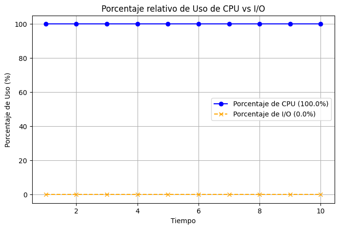
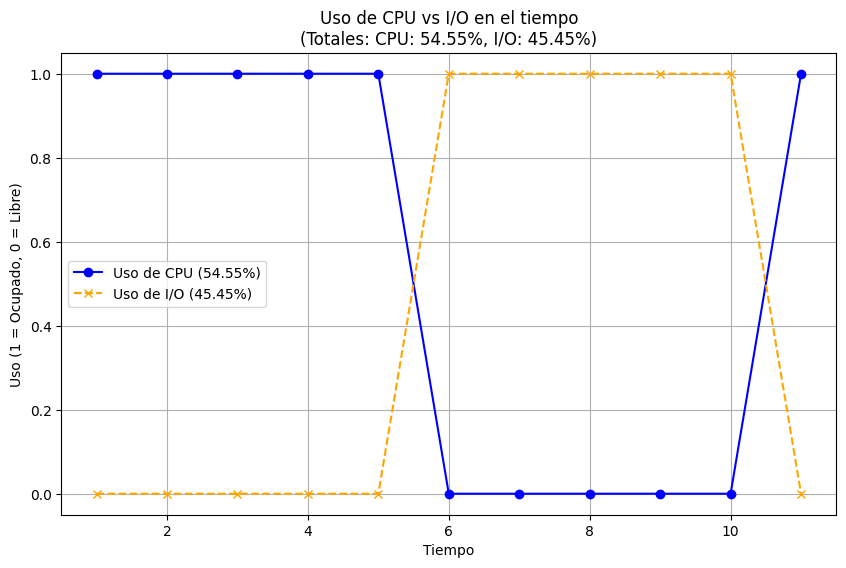
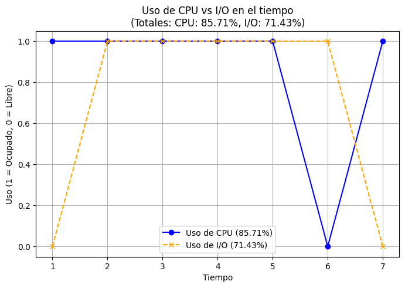

# Actividad de seguimiento - Simulación 1

| Integrante                   | correo                   | usuario github          |
| ---------------------------- | ------------------------ | ----------------------- |
| John Edison Zapata Ramirez   | john.zapata1@udea.edu.co | John3814                |
| Nombre completo integrante 2 | correo integrante 2      | gihub user integrante 2 |

## Instrucciones

Antes de empezar a realizar esta actividad haga un **fork** de este repositorio y sobre este trabaje en la solución de las preguntas planteadas en la actividad de simulación. Las respuestas deben ser respondidas en español o si lo prefiere en ingles en el lugar señalado para ello (La palabra **answer** muestra donde).

**Importante**:

- Como la actividad es en las parejas del laboratorio, solo uno de los integrantes tiene que hacer el fork; y sobre repositorio bifurcado que se genera, la modificación se realiza en equipo.
- Como la entrega se debe hacer modificando el archivo READNE, se recomienda que consulte mas sobre el lenguaje **Markdown**. En el repo adjuntan dos cheatsheet ([cheat sheet 1](Markdown_Cheat_Sheet.pdf), [cheatsheet 2](markdown-cheatsheet.pdf)) para consulta rapida.
- Entre mas creativo mejor.

## Homework (Simulation)

This program, [`process-run.py`](process-run.py), allows you to see how process states change as programs run and either use the CPU (e.g., perform an add instruction) or do I/O (e.g., send a request to a disk and wait for it to complete). See the [README](https://github.com/remzi-arpacidusseau/ostep-homework/blob/master/cpu-intro/README.md) for details.

### Questions

1. Run `process-run.py` with the following flags: `-l 5:100,5:100`. What should the CPU utilization be (e.g., the percent of time the CPU is in use?) Why do you know this? Use the `-c` and `-p` flags to see if you were right.

   

   
Answer

   As in the process list, we can see there are two processes, each with 5 `X` instructions, and with a CPU utilization percentage for both of them of 100% `Y`, i.e., there are no I/O instructions. Therefore, the total CPU utilization should be 100%.
     
   This is confirmed by running the program like this:
     

      | Time | PID: 0     | PID: 1     | CPU   | IOs    |
      |------|------------|------------|-------|--------|
      | 1    | RUN:cpu    | READY      | 1     |        |
      | 2    | RUN:cpu    | READY      | 1     |        |
      | 3    | RUN:cpu    | READY      | 1     |        |
      | 4    | RUN:cpu    | READY      | 1     |        |
      | 5    | RUN:cpu    | READY      | 1     |        |
      | 6    | DONE       | RUN:cpu    | 1     |        |
      | 7    | DONE       | RUN:cpu    | 1     |        |
      | 8    | DONE       | RUN:cpu    | 1     |        |
      | 9    | DONE       | RUN:cpu    | 1     |        |
      | 10   | DONE       | RUN:cpu    | 1     |        |

      **Stats:**  
      - **Total Time:** 10  
      - **CPU Busy:** 10 (100.00%)  
      - **IO Busy:** 0 (0.00%)  
       
      
   

    

2. Now run with these flags: `./process-run.py -l 4:100,1:0`. These flags specify one process with 4 instructions (all to use the CPU), and one that simply issues an I/O and waits for it to be done. How long does it take to complete both processes? Use `-c` and `-p` to find out if you were right.

   

   
Answer

   For the first process, there are 4 instructions, all using the CPU exclusively, with no input/output (I/O) operations. Therefore, this process takes 4 time units to complete.  

   As for the second process, it consists of an I/O operation. This means that it initially uses the CPU to call the I/O instruction, and then enters the BLOCKED state. In this state, by default, it takes 5 time units to complete the operation. Once completed, the process returns to the CPU (if it is free) to complete execution. In total, this process takes 7 time units (2 on the CPU and 5 in the BLOCKED state).  

   Finally, we can deduce that it takes 11 time units to complete both processes.
     

      | Time | PID: 0         | PID: 1           | CPU Busy | IO Busy |
      |------|-----------------|------------------|----------|---------|
      | 1    | RUN:cpu        | READY            | 1        | 0       |
      | 2    | RUN:cpu        | READY            | 1        | 0       |
      | 3    | RUN:cpu        | READY            | 1        | 0       |
      | 4    | RUN:cpu        | READY            | 1        | 0       |
      | 5    | DONE           | RUN:io           | 1        | 0       |
      | 6    | DONE           | BLOCKED          | 0        | 1       |
      | 7    | DONE           | BLOCKED          | 0        | 1       |
      | 8    | DONE           | BLOCKED          | 0        | 1       |
      | 9    | DONE           | BLOCKED          | 0        | 1       |
      | 10   | DONE           | BLOCKED          | 0        | 1       |
      | 11   | DONE           | RUN:io_done      | 1        | 0       |

      #### Estadísticas
      - Total Time: **11**
      - CPU Busy: **6** (54.55%)
      - IO Busy: **5** (45.45%)
     
   
     
   

    

3. Switch the order of the processes: `-l 1:0,4:100`. What happens now? Does switching the order matter? Why? (As always, use `-c` and `-p` to see if you were right)

   

   
Answer

   It does matter, since both processes execute in less time. That is, each one individually takes the same amount of time as in the previous case, but together they take much less time.  

   This is because, while the process with I/O instructions is in the BLOCKED state, the other process can take advantage of the free CPU to execute its instructions. This allows for better CPU utilization and allows both processes to complete their execution much faster.  

   | Time | PID: 0         | PID: 1           | CPU Busy | IO Busy |
   |------|-----------------|------------------|----------|---------|
   | 1    | RUN:io         | READY            | 1        | 0       |
   | 2    | BLOCKED        | RUN:cpu          | 1        | 1       |
   | 3    | BLOCKED        | RUN:cpu          | 1        | 1       |
   | 4    | BLOCKED        | RUN:cpu          | 1        | 1       |
   | 5    | BLOCKED        | RUN:cpu          | 1        | 1       |
   | 6    | BLOCKED        | DONE             | 0        | 1       |
   | 7    | RUN:io_done    | DONE             | 1        | 0       |

   #### Estadísticas
   - **Total Time:** **7** unidades de tiempo.
   - **CPU Busy:** **6** unidades (85.71%).
   - **IO Busy:** **5** unidades (71.43%).

     
   
   

    

4. We'll now explore some of the other flags. One important flag is `-S`, which determines how the system reacts when a process issues an I/O. With the flag set to SWITCH ON END, the system will NOT switch to another process while one is doing I/O, instead waiting until the process is completely finished. What happens when you run the following two processes (`-l 1:0,4:100 -c -S SWITCH ON END`), one doing I/O and the other doing CPU work?

   

   
Answer

   Coloque aqui su respuerta
   

    

5. Now, run the same processes, but with the switching behavior set to switch to another process whenever one is WAITING for I/O (`-l 1:0,4:100 -c -S SWITCH ON IO`). What happens now? Use `-c` and `-p` to confirm that you are right.

   

   
Answer

   Coloque aqui su respuerta
   

    

6. One other important behavior is what to do when an I/O completes. With `-I IO RUN LATER`, when an I/O completes, the process that issued it is not necessarily run right away; rather, whatever was running at the time keeps running. What happens when you run this combination of processes? (`./process-run.py -l 3:0,5:100,5:100,5:100 -S SWITCH ON IO -c -p -I IO RUN LATER`) Are system resources being effectively utilized?

   

   
Answer

   Coloque aqui su respuerta
   

    

7. Now run the same processes, but with `-I IO RUN IMMEDIATE` set, which immediately runs the process that issued the I/O. How does this behavior differ? Why might running a process that just completed an I/O again be a good idea?

   

   
Answer

   Coloque aqui su respuerta
   

    

### Criterios de evaluación

- [x] Despligue de los resultados y analisis claro de los resultados respecto a lo visto en la teoria.
- [x] Creatividad y orden.
